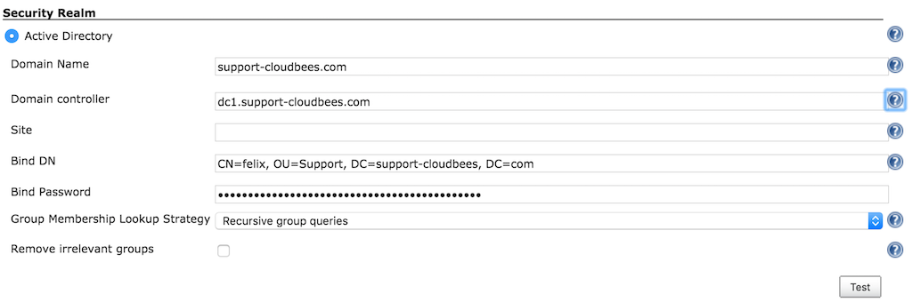

Active Directory plugin for Jenkins
===================================

[](https://ci.jenkins.io/job/Plugins/job/active-directory-plugin/job/master/)
[](https://plugins.jenkins.io/active-directory/)
[](https://github.com/jenkinsci/active-directory-plugin/releases/latest/)
[](https://plugins.jenkins.io/active-directory/)


With this plugin, you can configure Jenkins to authenticate the username and the password through Active Directory. This plugin internally uses two very different implementations, depending on whether Jenkins is running on Windows or non-Windows and if you specify a domain.

-   If Jenkins is running on a Windows machine and you do not specify a domain, that machine must be a member of the domain you wish to authenticate against. Jenkins uses ADSI to figure out all the details, so no additional configuration is required.
-   If Jenkins is running on a non-Windows machine (or you specify one or more domains), then you need to tell Jenkins the name of Active Directory domain(s) to use. 
Jenkins then uses DNS SRV records and LDAP service of Active Directory to authenticate users.

Jenkins recognizes all the groups in Active Directory that the user belongs to, so you can use those to make authorization decisions (for example you can choose the matrix-based security as the authorization strategy and perhaps allow "Domain Admins" to administer Jenkins).

#### Active Directory Health Status

Since the version 2.5 the AD plugin adds a ManagementLink to report a Health Status about the Domain and Domain controllers. In order to correctly use this feature, you should be logged-in into the instance and the cache should be disabled. Then, you will get:

-   The Domain health
    -   DNS resolution
    -   Global Catalog
    -   Ldap Catalog
-   The Domain Controller Health
    -   If the user can login into the DC
    -   The Connection time
    -   The total time in the lookup process


#### Fall-back user

-   Since the version 2.5 of the AD plugin, you can define a user to fall back in case there is a communication issue between Jenkins and the AD server.
-   On this way, this admin user can be used to continue administering Jenkins in case of communication issues, where usually you were following the link [Disable security](https://www.jenkins.io/doc/book/system-administration/security/#disabling-security). 
-   The password of this user is automatically synced with the Jenkins Internal Database by this feature. In order to configure this new feature you should enable \*Use Jenkins Internal Database\* in the AD configuration under Manage Jenkins → Configure Global Security and specify a SINGLE user by its username.

This feature DOES NOT synchronize users in the Active Directory server and the Jenkins Internal Database. It ONLY allows you to have a SINGLE fallback user who must be previously created in Jenkins side. In order to create this user, you can go to Manage Jenkins -> Configure Global Security -> Security Realm -> Jenkins’ own user database [enable Allow users to sign up]. This will allow you to create a new user with the password that you would like. After this, you can change again to use Active Directory as Security Realm and use the fall-back user. 

Another possibility is to execute the Groovy code below under Manage Jenkins -> Script console. This code will create the `admin` user into the Jenkins Internal Database with the password `mypassword`. **Don't forget to customize this user with the username/password that you would like.**

```
import hudson.security.HudsonPrivateSecurityRealm;

HudsonPrivateSecurityRealm hudsonPrivateSecurityRealm = new HudsonPrivateSecurityRealm(true, true, null);
hudsonPrivateSecurityRealm.createAccount("admin", "mypassword");
```

IMPORTANT: This fallback user will ONLY work under a `NamingException`, which includes `CommunicationException`. This means that it does not always fallback into the fallback user. It will only do it when there are problems when contacting the AD server.
  


#### [SECURITY-251](https://www.jenkins.io/security/advisory/2017-03-20/#SECURITY-251) Active Directory Plugin did not verify certificate of AD server

From versions \< 2.3 the Active Directory Plugin did not verify certificates of the Active Directory server, thereby enabling Man-in-the-Middle attacks. From version 2.3 the plugin allows to choose between a secured option and continue trusting all the certificates.

In case there was an Active Directory configured previously on the instance after upgrading the plugin the following Administrative Monitor will appear.


To avoid this message to appear again in case you would like to continue trusting all the certificates, the only thing you need to do is to go to Manage Jenkins -\> Configure Global Security and hit the button saved. Then, the Administrative Monitor should not appear anymore as you acknowledge that you are fine by continuing on this TrustAllCertificates mode.

However, for security reasons the recommendation is to move to the secured option. This can be done on the Active Directory configuration under the Advanced button by selecting TLS configuration: JDK TrustStore. When this option is enabled notice that then in case your Active Directory server is using a self sign certificate, which usually is the case, you must then:


1\. Export the certificate from your AD server  
2\. Create a custom keystore from the JVM keystore

For Unix:

    CUSTOM_KEYSTORE=$JENKINS_HOME/.keystore/
    mkdir -p $CUSTOM_KEYSTORE
    cp $JAVA_HOME/jre/lib/security/cacerts $CUSTOM_KEYSTORE

For Windows:

    CUSTOM_KEYSTORE=%JENKINS_HOME%\.keystore\
    md %CUSTOM_KEYSTORE%
    copy %JAVA_HOME%\jre\lib\security\cacerts %CUSTOM_KEYSTORE%

3\. Import your certificate

For Unix:

    $JAVA_HOME/bin/keytool -keystore $JENKINS_HOME/.keystore/cacerts \
      -import -alias <YOUR_ALIAS_HERE> -file <YOUR_CA_FILE>

For Windows:

    %JAVA_HOME%\bin\keytool -keystore %JENKINS_HOME%\.keystore\cacerts -import -alias <YOUR_ALIAS_HERE> -file <YOUR_CA_FILE>

4\. Add the certificate to the Jenkins startup parameters:

The following JAVA properties should be added depending on your OS:

For Unix:

    -Djavax.net.ssl.trustStore=$JENKINS_HOME/.keystore/cacerts \
    -Djavax.net.ssl.trustStorePassword=changeit

For Windows:

    -Djavax.net.ssl.trustStore=%JENKINS_HOME%\.keystore\cacerts
    -Djavax.net.ssl.trustStorePassword=changeit

5\. Follow section Securing access to Active Directory servers to enable LDAPS

Disaster recovery: In case that after all of this you cannot login anymore, you should enable the logging on the plugin to understand why it is failing. In case that after you enable the secured option you cannot login on the instance anymore, you might want to quickly fallback to the previous status specially on production environments. You can easily do this by going to $JENKINS\_HOME/config.xml and under the section \<securityRealm class="hudson.plugins.active_directory.ActiveDirectorySecurityRealm" revert the tlsConfiguration to the previous status. A restart is needed.

    <tlsConfiguration>TRUST_ALL_CERTIFICATES</tlsConfiguration>

#### IMPORTANT Active Directory 2.0 - Better multi-domains support

The latest release of the Active Directory plugin provides you a better multi-domains support.


Users running Active Directory plugin 1.49 might be locked in case they were using Multiple Domains with Multiple Domains Controllers - this is the side effect of fixing the possibility of locking an account when not using Domain Controllers by a simple password mistake. The problematic
[PR is here](https://github.com/jenkinsci/active-directory-plugin/pull/41).

In case this is the case and you are locked, you just need to go to $JENKINS\_HOME/config.xml and modify the \<servers\> section deleting the ones which are not a member of the corresponding domain.

    <securityRealm class="hudson.plugins.active_directory.ActiveDirectorySecurityRealm" plugin="active-directory@2.0">
        <domains>
          <hudson.plugins.active__directory.ActiveDirectoryDomain>
            <name>support-cloudbees-2.com</name>
            <servers>192.168.1.32:3268,192.168.1.33:3268</servers>
          </hudson.plugins.active__directory.ActiveDirectoryDomain>
          <hudson.plugins.active__directory.ActiveDirectoryDomain>
            <name>support-cloudbees.com</name>
            <servers>192.168.1.16:3268,192.168.1.17:3268</servers>
          </hudson.plugins.active__directory.ActiveDirectoryDomain>
        </domains>
        <bindName>bindUser</bindName>
        <bindPassword>dk5ISc2eOWTrub9YFUkfFzSsUvy061yV4/Udna+0Wa0=</bindPassword>
        <groupLookupStrategy>RECURSIVE</groupLookupStrategy>
        <removeIrrelevantGroups>false</removeIrrelevantGroups>
      </securityRealm>

A restart of the instance is needed after this.

#### Securing access to Active Directory servers

There are two possible options for securing access to Active Directory:

##### A.- LDAP + StartTLS (by default) 

Active Directory plugin performs [TLS upgrade](http://en.wikipedia.org/wiki/Lightweight_Directory_Access_Protocol#StartTLS) (StartTLS), it connects to domain controllers through insecure LDAP, then from within the LDAP protocol it "upgrades" the connection to use [TLS](https://en.wikipedia.org/wiki/Transport_Layer_Security), achieving the same degree of confidentiality and server authentication as LDAPS does.

As the server needs to have a valid X509 certificate for this to function, if the server fails to do TLS upgrade, the communication continues to happen over insecure LDAP. In other words, in the environment that the server supports this, it'll automatically use a properly secure connection. See [TechNet article](http://social.technet.microsoft.com/wiki/contents/articles/2980.ldap-over-ssl-ldaps-certificate.aspx) for how to install a certificate on your AD domain controllers to enable this feature.

To verify if the connection is upgraded or not, see [Logging](https://www.jenkins.io/doc/book/system-administration/viewing-logs/) and adds a logger to `hudson.plugins.active_directory.ActiveDirectorySecurityRealm` for FINE or above. Search for "TLS" in the log messages. 

##### B.- LDAPS

On the other hand, if you wish on using LDAPS, you should set:

-   System property `-Dhudson.plugins.active_directory.ActiveDirectorySecurityRealm.forceLdaps=true` as a startup parameter to force Jenkins to start a connection with LDAPS. 
-   Use secured port is defined 636 or 3269
    (`your.hostname.com\[\|:636\|:3269\]`)

 Note that
`-Dhudson.plugins.active_directory.ActiveDirectorySecurityRealm.forceLdaps=true` skips the default LDAP + TLS upgrade.

#### Override domain controllers

This plugin follows the standard lookup procedure to determine the list of candidate Active Directory domain controllers, and this should be sufficient for the normal circumstances. But if for some reasons it isn't, you can manually override and provide the list of domain controllers by specifying the "Domain controller" field in the advanced section with the value of the format "host:port,host:port,...". The port should normally be 3269 (for global catalog over SSL), 636 (LDAP over SSL), 3268 (for global catalog), or 389 (LDAP).

For historical reasons, the system property "hudson.plugins.active\_directory.ActiveDirectorySecurityRealm.domainControllers" for this purpose is still supported, but starting with 1.28, the configuration in the UI is preferred.

If you have multiple AD domains federated into a forest, be sure to use a [global catalog](https://technet.microsoft.com/en-us/library/cc728188%28v=ws.10%29.aspx), or else you will fail to find group memberships that are defined in other domains.

#### Group Names

If you have added a group and it appears in the list with a red stop sign, Jenkins cannot find it. Remove it and investigate why.

If you are not sure what the notation for a group name is, try the following procedure:

1.  Grant full access to anonymous user (in case you have to reconfigure security having logged out)
2.  Configure the AD server, test it, and save the configuration
3.  Log in using the AD user. Click your name to see a page listing the groups you were found in
4.  Add the relevant groups found to the security matrix with appropriate permissions
5.  Do not forget to withdraw permissions from the anonymous user, taking into consideration the Overall:Read permission (hover over the column header for detail)

## Troubleshooting

#### Create/Update a dedicated Logs Recorder

If you think you've configured everything correctly but still not being able to login (or any other problems), please enable [Logging](https://www.jenkins.io/doc/book/system-administration/viewing-logs/) and configure logging level for "hudson.plugins.active_directory" to ALL. Attempt a login and then file a ticket with the log output.

Also, it might be useful to enable:

    hudson.security = ALL
    jenkins.security = ALL
    org.acegisecurity.ldap = ALL
    org.acegisecurity.providers.ldap = ALL

#### Use a tool like 'ldapsearch' to validate credentials and authentication settings

Take care to escape special character with \`\\\` in case it is necessary.

For TLS end-points:

    ldapsearch -LLL -H ldaps://<DOMAIN_NAME_> -M -b "<searchbase>" -D "<binddn>" -w "<passwd>" "(<userid>)"

For non-TLS end-points:

    ldapsearch -LLL -H ldap://<DOMAIN_NAME> -M -b "<searchbase>" -D "<binddn>" -w "<passwd>" "(<userid>)"

In case you don't want to show your password, you might want to use the command below instead - to be prompted for it.

    ldapsearch -LLL -H ldap://<DOMAIN_NAME> -M -b "<searchbase>" -D "<binddn>" -W "(<userid>)"

All these fields should match with the following fields in the AD plugin configuration:


-   \<DOMAIN\_NAME\> -\> Domain Name: support-cloudbees.com
-   \<searchbase\> -\> Organization Unit we want to look into. In the example, it is OU=Support, DC=support-cloudbees, DC=com
-   \<binddn\> -\> Bind DN. In the exaple, CN=felix, OU=Support, DC=support-cloudbees, DC=com
-   \<passwd\> -\> Bind Password
-   \<userid\> -\> User we want to look for. We can look for the managerDN itself or for a different user on the tree. In the example, this can be set-up for example to CN=felix, OU=Support, DC=support-cloudbees, DC=com.

#### If using Domain controller check that all servers on the farm are working correctly

In case, we are using a Domain Controller like in the example below we might want to list all the AD servers in the farm by using:

    nslookup <DOMAIN_CONTROLLER>



It might happen that one of the servers in the farm is incorrectly replicated and the ad-plugin is sticky with this one, so we might want to check with ldapsearch command or the Test button in the GUI that all the servers are working correctly trying to look for an user on the tree.

#### If using Domain controller check that all servers on the farm are working correctly

You can check this by using:

    nslookup -q=SRV _ldap._tcp.<DOMAIN_NAME>

    nslookup -q=SRV _gc._tcp.<DOMAIN_NAME>

## Version History

See the [changelog](https://github.com/jenkinsci/active-directory-plugin/blob/master/CHANGELOG.md).

## Release Notes

See [Github Release](https://github.com/jenkinsci/active-directory-plugin/releases).
